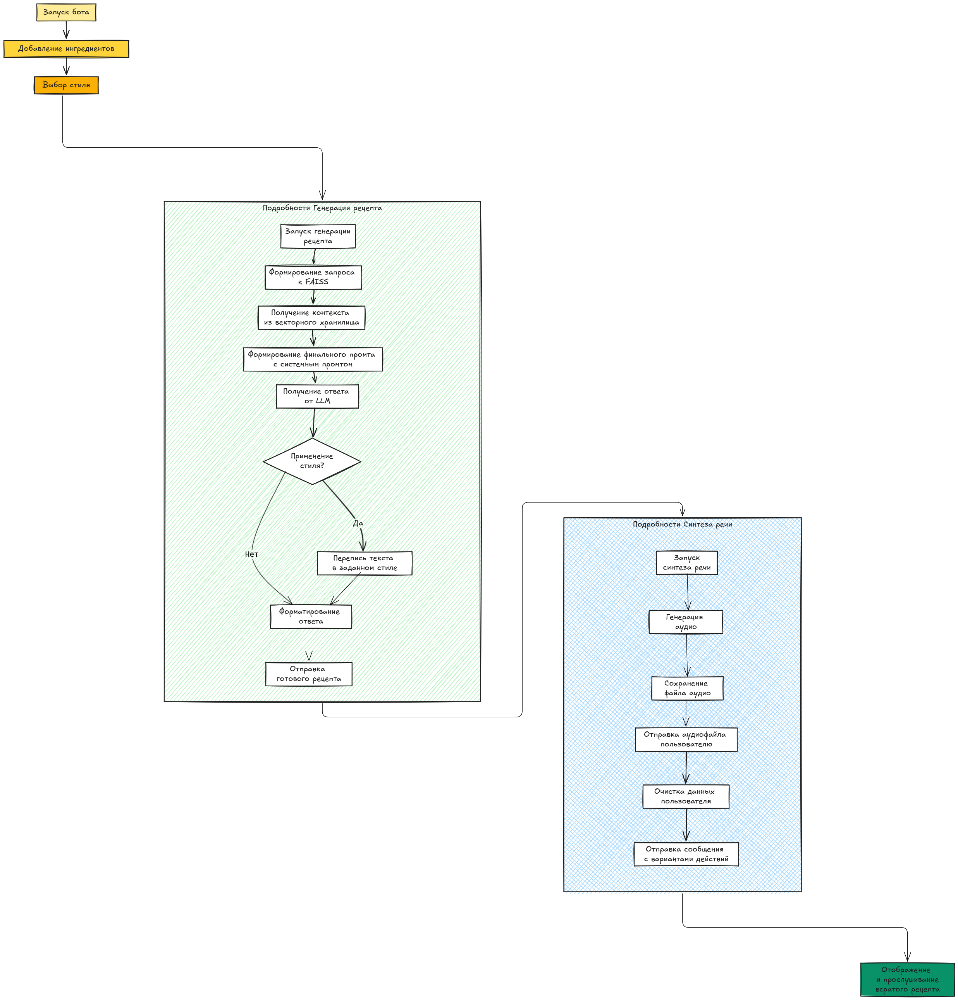

# 🍸 Cocktail Recipe Bot
## 🎯 Замысел ~~Отель `У погибшего пессимиста`~~
Изначально у меня была идея реализовать возможность поиска по, главным образом, алкогольным коктейлям, исходя из наличия имеющихся у пользователя ингредиентов. А чтобы он мог сохранять свои находки, можно было реализовать функцию генерации `QR` кода. Однако в ходе предпроектного анализа выяснилось, что подобная возможность не будет востребованной по ряду причин. В связи с этим было решено вместо генерации кодов (к этой идее возможно мы вернёмся впоследствии) реализовать озвучку рецептов. А поскольку имеющиеся возможности синтеза речи не очень хорошо (скорее всего, это реализуемо) воспроизводят интонацию и эмоции, то при прослушивании результата пользователь улыбнётся, покажет/перешлёт товарищу рецепт, и, тем самым, запомнит, что можно сделать из имеющейся под рукой алкашки. 

## ⚡ Основные возможности
### 🔄 Принципы функционирования приложения
1. 📚 Поиск коктейлей по книге `Мастер шейков и «Маргариты»`
2. 🧩 Оптимизированное разбиение документа на чанки
3. 🌐 Многоязычная модель эмбеддингов `cointegrated/LaBSE-en-ru`
4. 🤖 LLM-агент на базе `Mistral-7B-Instruct-v0.3`
5. 🗣️ Синтез речи через `snakers4/silero-models`
6. ⚙️ Ответ синтезируется в речь методом синхронного синтеза. Синхронный подход обоснован необходимостью блокировки выполнения программы до завершения запроса в очереди, что опосредованно 
влияет на расход дорогостоящих токенов.

### 🛠️ Технические возможности
1. 🧪 Тестирование различных моделей:
   - 🔹 проприетарный [OpenAI](/debug/debug_chatgpt.ipynb) (`gpt-3.5-turbo` / `gpt-4o-mini`)
   - 🔹 моднейший [deepseek-llm-7b-chat](/debug/debug_deepseek.ipynb)
   - 🔹 с открытым кодом [mistral-7B-instruct-v0.3](/debug/debug_mistral.ipynb)
2. 🎙️ Тестирование синтеза речи:
   - 🔊 проприетарный [SaluteSpeech](/debug/synthesize_salutspeech.ipynb)
   - 🔊 с открытым кодом [Silero](/debug/synthesize_silero.ipynb)

### 👥 Пользовательские возможности
1. 🔍 Поиск коктейлей по имеющимся ~~в заначке~~ ингредиентам
2. 📝 Шесть стилей изложения рецептов
3. 🎧 Прослушивание рецептов
4. 🎭 Уникальный стиль для текста и звука

## 🚀 Начало работы

### 📋 Требования к системе
- 🐍 Python 3.12+
- 🐳 Docker
- 🤖 Локальная модель Ollama
- 💾 ~14 Гб свободного места
- 📦 Зависимости из requirements.txt

### 🔑 Предварительная настройка
1. Создайте в телеграмм через `BotFather` бот и получите ключ API доступа к нему
2. Создайте файл `.env` с ключами `HUGGINGFACEHUB_API_TOKEN` и `TELEGRAM_BOT_TOKEN`:
   ```
    - HUGGINGFACEHUB_API_TOKEN = ключ
    - TELEGRAM_BOT_TOKEN=YOUR_TELEGRAM_BOT_TOKEN_HERE
    # опционально (в перспективе)
    - SBER_API_KEY = ключ_авторизации
    - OPENAI_API_KEY = ключ
   ```
3. Ежели решили использовать запуск моделей локальных, чтобы денежку не тратить зазря, тогда необходимо предварительно запустить модель. Например, 
   ```bash
   ollama run mistral:instruct
   ``` 

### 📥 Установка и локальный запуск
1. Склонируйте репозиторий:
   ```bash
   git clone git@github.com:trofimovelijah/cocktail_qr.git
   cd cocktail_qr
   ```
2. Создайте и активируйте виртуальное окружение:   
   ```bash
   python -m venv .venv
   source .venv/bin/activate  # Linux/MacOS
   ```
3. Установите зависимости:   
   ```bash
   pip install -r requirements.txt   
   ```
4. Запустите `Ollama` в новом терминале:  
   ```bash
   ollama run mistral:instruct   
   ```
5. Запустите бота:   
   ```bash
   python /models/telegram_bot.py
   ```

Преимущества этого подхода:
- 🚀 Более быстрая работа языковой модели
- 💾 Меньше потребление памяти
- 🔄 Возможность использовать Ollama для других проектов
- 🛠️ Проще обновлять модель

## 🎨 Стили рецептов
1. 👻 Космический ужас (Г.Ф. Лавкрафт)
2. 🤙 Гопническо-быдляцкий жаргон
3. 🎭 Экспериментальный стиль У. Берроуза
4. 📝 Классический стиль
5. 📊 Сухое математическое изложение учебника по математической статистике и теории вероятностей
6. 🎶 Метафорическая образность песен Егора Летова и Гражданской обороны

## 📁 Структура проекта
```
cocktail_qr/
├── 🐳 Dockerfile
├── 🐋 docker-compose.yml
├── 📋 requirements.txt
├── 🔑 .env
├── 📂 models/
│ ├── 🤖 recipe_finder.py           # Логика поиска рецептов
│ ├── 🎙️ speech_generator.py        # Логика генерации речи
│ └── 🤖 telegram_bot.py            # Основной код бота
├── 💾 data/                        # Векторное хранилище
├── 📚 docs/                        # Файлы с рецептами
├── 🧪 debug/                       # Тетради-ноутбуки для отладки различных решений
└── 🎵 audio/                       # Директория для аудиофайлов
```

## ✨ Особенности реализации
1. 🏗️ **Архитектура бота**:
   - Синхронная работа через ConversationHandler
   - Модульная структура с разделением ответственности
   - Сохранение контекста разговора в user_data

2. 🖥️ **Пользовательский интерфейс**:
   - Пошаговый ввод ингредиентов с возможностью добавления нескольких
   - Интерактивные кнопки для управления процессом
   - Выбор стиля изложения рецепта
   - Возможность отмены операции на любом этапе

3. 🔄 **Обработка рецептов**:
   - Векторный поиск рецептов по ингредиентам
   - Стилизация текста через LLM
   - Гибкая система стилей с возможностью расширения

4. 🎙️ **Генерация речи**:
   - Использование `Silero TTS` для синтеза речи
   - Различные голоса и эмоции для разных стилей
   - Сохранение аудиофайлов с уникальными именами

### Как сейчас функционирует


## 🔮 Планируемые ближайшие улучшения
1. 🔍 [Улучшение поиска из непосредственно векторного хранилища `FAISS`](https://github.com/trofimovelijah/cocktail_qr/issues/1)
2. 📊 Оптимизация разбиения на чанки ([ошибка](https://github.com/trofimovelijah/cocktail_qr/issues/2))
3. 🤖 [Идеологическая переделка `AI-агента` (_неверная реализация_)](https://github.com/trofimovelijah/cocktail_qr/issues/3) 
4. 🔧 Тюнинг промтов
5. 🎨 [Тюнинг стилей ответа](https://github.com/trofimovelijah/cocktail_qr/issues/19)
6. 🐳 [Контейнеризация тг-бота](https://github.com/trofimovelijah/cocktail_qr/issues/4)
7. 🛠️ Отладка с другими инструментами работы с LLM: 
   - `LM Studio`,
   - `lamacpp`, 
   - `Hugging Face Transformers`, 
   - `vllm`, 
   - `CTranslate2`
8. ⏳ [Оптимизация жизненного цикла функционирования тг-бота](https://github.com/trofimovelijah/cocktail_qr/issues/8)
9. 🍹 [Переделка бизнес-логики формирования рецептов](https://github.com/trofimovelijah/cocktail_qr/issues/5) с возможностью на выбор писателя, а не ингредиента
10. 📜 [Логирование кода](https://github.com/trofimovelijah/cocktail_qr/issues/17)
11. [Модификация окна приветствия](https://github.com/trofimovelijah/cocktail_qr/issues/16)

## 📋 Бэклог
1. 🔍 Точный поиск по ингредиентам
2. 💳 Оплата через звёзды Telegram
3. 🤖 Выбор LLM-модели при генерации ответа
4. 🎤 Выбор LLM-модели при синтезе звука
5. 🗺️ Интеграция и поиск по карте (премиум)
6. 🏪 Поиск по локальным магазинам (после интеграции с картами)
7. 💰 Расчёт стоимости коктейля

## 📄 Лицензия
Проект распространяется под лицензией MIT. Подробности в файле [LICENSE](LICENSE).